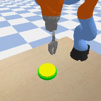
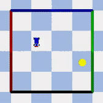
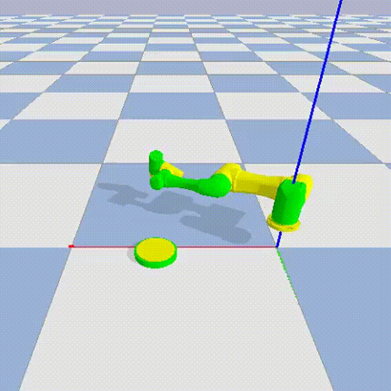
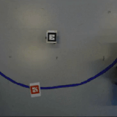
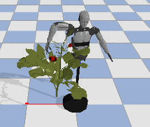

# POAR-SRL-4-Robot: An efficient state representation approach for robotic scenarios

This repository is based on a fork from [S-RL Repo](https://github.com/araffin/robotics-rl-srl) [<sup>2</sup>](#refer-anchor). In our implementation, we further integrate the SRL model with RL throughout the course of training,
where both models are trained simultaneously to overcome previous obstacles in decoupling methods [<sup>1</sup>](#refer-anchor) such as over-fitting and incomplete learned states.
This is the accompanying repository that provides the implementation of algorithm and environment simulator that we propose in the paper POAR: Efficient Policy Optimization via Online Abstract State Representation Learning which we submit to IEEE Intelligent Systems for review.

With this repository, we can both evaluate the prevailing decoupling State Representation Learning methods and the coupling model **POAR** (Policy Optimization via Abstract Representation), together with reinforcement learning. The previous [S-RL Repo](https://github.com/araffin/robotics-rl-srl) integrates (automatic logging, plotting, saving, loading of trained agent) various RL algorithms (PPO, A2C, ARS, ACKTR, DDPG, DQN, ACER, CMA-ES, SAC, TRPO) from [Stable Baselines](https://github.com/araffin/rl-baselines-zoo) along with various decoupling SRL priors (see [SRL Repo](https://github.com/araffin/srl-zoo)) in an efficient way (1 Million steps in 1 Hour with 8-core cpu and 1 Titan X GPU).

The general framework of our POAR model is illustrated below.


Related papers:
- "Decoupling feature extraction from policy learning: assessing benefits of state representation learning in goal based robotics" (Raffin et al. 2018) [https://arxiv.org/abs/1901.08651](https://arxiv.org/abs/1901.08651)
- "S-RL Toolbox: Environments, Datasets and Evaluation Metrics for State Representation Learning" (Raffin et al., 2018) [https://arxiv.org/abs/1809.09369](https://arxiv.org/abs/1809.09369)


## Main Features

- 10 RL algorithms ([Stable Baselines](https://github.com/hill-a/stable-baselines) included)
- logging / plotting / visdom integration / replay trained agent
- hyperparameter search (hyperband, hyperopt)
- train an expert model and collect demonstration
- integration with State Representation Learning (SRL) methods (for feature extraction)
- visualisation tools (explore latent space, display action proba, live plot in the state space, ...)
- robotics environments to compare SRL approaches
- easy install using anaconda env or Docker images (CPU/GPU)


## Documentation

The documentation of [S-RL Repo](https://github.com/araffin/robotics-rl-srl) is available online: [https://s-rl-toolbox.readthedocs.io/](https://s-rl-toolbox.readthedocs.io/). And the documentation of [SRL Repo](https://github.com/araffin/srl-zoo) is also available online: [https://srl-zoo.readthedocs.io/](https://srl-zoo.readthedocs.io/). More details of our modification to establish POAR, please refer to our conference paper.

## Example

The entry file is defined in \rl_baselines\train.py. To train a model with POAR framework, simply employ `poar` for `--algo` argument since we've registered it in the local stable baseline module.

Here is a quick example of how to train a **POAR** agent on `OmnirobotEnv-v0` environment with circling task for 2000000 steps using 8 parallel processes:
```
python -m rl_baselines.train --seed 0 --log-dir ./logs/path_to_log/ --algo poar --num-timesteps 2000000 --env OmnirobotEnv-v0 --structure srl_autoencoder --losses autoencoder:1:120 reward:5:-1  inverse:2:50 forward:1:50 --num-cpu 8 --gpu 0 -r -cc
```

`--losses autoencoder:1:120 reward:5:-1  inverse:2:50 forward:1:50` means we stack different SRL priors with weights attribution: 1:5:2:1, respectively on separate state dimensions: 120:50:50 using a split mode. More details [here](https://srl-zoo.readthedocs.io/en/latest/guide/srl.html). `-1` means we apply the SRL prior on the same state space as the previous one.

To engage *domain resemblance prior* which leverages expert demonstration, it is required to specify more arguments. For example:
```
python -m rl_baselines.train --seed 0 --log-dir ./logs/path_to_log/ --algo poar --num-timesteps 2000000 --env OmnirobotEnv-v0 --structure srl_autoencoder --losses autoencoder:1:120 reward:1:-1  inverse:5:50 forward:5:50 domain:1:2 forward:5:-1 --num-cpu 8 --gpu 0 -r -cc --demon-path './path_to_demonstration' -sg
```

Two more arguments need to be specified to run **POAR** model with *domain resemblance prior*. `--demon-path` to specify the path to stored demonstration data (we'll explain later the format of the data and how to collect them) and `-sg` to specify whether you apply for access to the state graph during the course of training.

To train a decoupling SRL model, the command is as simple as:

```
python -m rl_baselines.train --algo rl_algo --env env1 --log-dir ./logs/path_to_log/ --srl-model srl_model_to_use --num-timesteps 2000000
```

Note that `--algo` can not be `poar` if you wish to train an RL agent using decoupling strategy. 

To use the robot's position as input instead of pixels, just pass `--srl-model ground_truth` instead of `--srl-model raw_pixels`

To perform a cross evaluation for the different srl model, one could run in the terminal:

```
python -m rl_baselines.pipeline_cross --algo ppo2 --log-dir logs/ --srl-model srl_comnbination ground_truth --num-iteration 5 --num-timesteps 1000000 --task cc sqc sc --srl-config-file config/srl_models1.yaml config/srl_models2.yaml config/srl_models3.yaml
```
This will output the learning result into the repository logs.

## Training Pipeline ##
### POAR Model ###
Since to train a **POAR** model without the presence of `domain resemblance prior` is very simple which you can find the complete command above, here we mainly discuss the steps to train **POAR** with expert demonstration engaged.
+ Obtain expert demonstration using [collect_ground_truth](https://github.com/BillChan226/POAR-SRL-4-Robot/blob/poar/environments/collect_ground_truth.py)
+ Train your RL agent

Here is a quick example of how to obtain expert demonstration:
```
python -m environments.collect_ground_truth --no-record-data --run-policy ppo2 --ppo2-timesteps 100000 --env OmnirobotEnv-v0 --num-episode 50 --num-cpu 1
```
Specify `--run-policy` with `ppo2` and '--no-record-data' (here it means we don't record raw-pixel images but ground-truth). Clearly, the expert is derived by training a PPO agent with `--ppo2-timesteps` steps. This demonstration collector does not support multiple concurrent policy yet, se please specify `--num-cpu` with `1`, otherwise you'll just obtain part of the collection.


### Decoupling Strategy ###
For decoupling strategy, the training pipeline is as followed:
+ Collect raw visual data using [data_generator](https://github.com/BillChan226/POAR-SRL-4-Robot/blob/poar/environments/dataset_generator.py)
+ Train an SRL model using [/srl_zoo/train](https://github.com/BillChan226/POAR-SRL-4-Robot/blob/poar/srl_zoo/train.py)
+ Register the trained SRL model in the [config file](https://github.com/BillChan226/POAR-SRL-4-Robot/tree/poar/config)
+ Train your RL agent

The argument for `srl-model` when you train an RL agent thus should be involved in the keys for your selected environment.

To collect raw visual data with random actions, use:
```
python -m environments.dataset_generator --num-cpu 4 --name folder_name --env env1 --num-episode 50 --num-cpu 4
```

A quick example to train an SRL model with split optimization mode:
```
python train.py --data-folder data/path/to/dataset --losses autoencoder:1:20 inverse:10:2 --state-dim 22
```
`--data-folder` specifies the path in which you have stored the raw visual data. More details [here](https://srl-zoo.readthedocs.io/en/latest/guide/srl.html).


## Installation

**Python 3 is required** (python 2 is not supported because of OpenAI baselines)

Note: we are using [Stable Baselines](https://github.com/hill-a/stable-baselines), a fork of OpenAI Baselines with unified interface and other improvements (e.g. tensorboard support).

### Using Anaconda

0. Download the project (note the `--recursive` argument because we are using git submodules):
```
git clone https://github.com/BillChan226/POAR-SRL-4-Robot.git --recursive
```

1. Install the swig library:
```
sudo apt-get install swig
```

2. Install the dependencies using `environment.yml` file (for anaconda users) in the current environment
```
conda env create --file environment.yml
source activate ROBOTSRL
```

[PyBullet Documentation](https://docs.google.com/document/d/10sXEhzFRSnvFcl3XxNGhnD4N2SedqwdAvK3dsihxVUA)

### Using Docker

Please read the [documentation](https://s-rl-toolbox.readthedocs.io/) for more details.


## Reinforcement Learning

Several algorithms from [Stable Baselines](https://github.com/hill-a/stable-baselines) have been integrated along with some evolution strategies and SAC:

- A2C: A synchronous, deterministic variant of Asynchronous Advantage Actor Critic (A3C).
- ACER: Sample Efficient Actor-Critic with Experience Replay
- ACKTR: Actor Critic using Kronecker-Factored Trust Region
- ARS: Augmented Random Search (https://arxiv.org/abs/1803.07055)
- CMA-ES: Covariance Matrix Adaptation Evolution Strategy
- DDPG: Deep Deterministic Policy Gradients
- DeepQ: DQN and variants (Double, Dueling, prioritized experience replay)
- PPO1: Proximal Policy Optimization (MPI Implementation)
- PPO2: Proximal Policy Optimization (GPU Implementation)
- SAC: Soft Actor Critic
- TRPO: Trust Region Policy Optimization (MPI Implementation)

Please read the [documentation](https://s-rl-toolbox.readthedocs.io/) for more details on how to train/load an agent on discrete/continuous actions, and how to add your own rl algorithm.


### Hyperparameter Search

This repository also allows hyperparameter search, using [hyperband](https://arxiv.org/abs/1603.06560) or [hyperopt](https://papers.nips.cc/paper/4443-algorithms-for-hyper-parameter-optimization.pdf) for the implemented RL algorithms

for example, here is the command for a hyperband search on PPO2, ground truth on the mobile robot environment:
```bash
python -m rl_baselines.hyperparam_search --optimizer hyperband --algo ppo2 --env MobileRobotGymEnv-v0 --srl-model ground_truth
```

## Environments

All the environments we propose follow the OpenAI Gym interface. We also extended this interface (adding extra methods) to work with SRL methods (see [State Representation Learning Models](#state-representation-learning-models)). To facilitate the test on a more complex and dynamic environment, we add another 2 self-design robotic environments `Jaka` and `InMoov`.

### Available Environments

| **Kuka environment**       | **Mobile Robot environment**       | **Jaka environment**       | **Omnidirectional robot environment**       | **InMoov environment**       |
| -------------------------- | ---------------------------------- | -------------------------------- | ------------------------------------------- | ------------------------------------------- |
|  |  |  |              |              |


| **Name**                          | **Action space (discrete)**                | **Action space (continuous)**                 | **Rewards**                                                                                                                                             | **ground truth**                                  |
| --------------------------------- | ------------------------------------------ | --------------------------------------------- | ------------------------------------------------------------------------------------------------------------------------------------------------------- | ------------------------------------------------- |
| **Kuka**<br>**Button**            | 6 actions (3D cardinal direction)          | 3 axis (3D cardinal direction) <sup>(1)</sup> | 1 when target reached, -1 when too far from target or when table is hit, otherwise 0 <sup>(2)</sup> <sup>(3)</sup>                                                    | the X,Y,Z position of the effector <sup>(4)</sup> |
| **Kuka**<br>**RandButton**        | 6 actions (3D cardinal direction)          | 3 axis (3D cardinal direction) <sup>(1)</sup> | 1 when target reached, -1 when too far from target or when table is hit, otherwise 0 <sup>(2)</sup> <sup>(3)</sup>                                                    | the X,Y,Z position of the effector <sup>(4)</sup> |
| **Kuka**<br>**2Button**           | 6 actions (3D cardinal direction)          | 3 axis (3D cardinal direction) <sup>(1)</sup> | 1 when the first target is reached, 1 when the second target is reached, -1 when too far from target or when table is hit, otherwise 0 <sup>(2)</sup> | the X,Y,Z position of the effector <sup>(4)</sup> |
| **Kuka**<br>**MovingButton**      | 6 actions (3D cardinal direction)          | 3 axis (3D cardinal direction) <sup>(1)</sup> | 1 when target reached, -1 when too far from target or when table is hit, otherwise 0 <sup>(2)</sup> <sup>(3)</sup>                                                    | the X,Y,Z position of the effector <sup>(4)</sup> |
| **MobileRobot**<br>               | 4 actions (2D cardinal direction)          | 2 axis (2D cardinal direction)                | 1 when target reached, -1 for a wall hit, otherwise 0 <sup>(2)</sup>                                                                                    | the X,Y position of the robot <sup>(4)</sup>      |
| **MobileRobot**<br>**2Target**    | 4 actions (2D cardinal direction)          | 2 axis (2D cardinal direction)                | 1 when target reached, -1 for a wall hit, otherwise 0 <sup>(2)</sup>                                                                                    | the X,Y position of the robot <sup>(4)</sup>      |
| **MobileRobot**<br>**1D**         | 2 actions (1D cardinal direction)          | 1 axis (1D cardinal direction)                | 1 when target reached, -1 for a wall hit, otherwise 0 <sup>(2)</sup>                                                                                    | the X position of the robot <sup>(4)</sup>        |
| **MobileRobot**<br>**LineTarget** | 4 actions (2D cardinal direction)          | 2 axis (2D cardinal direction)                | 1 when target reached, -1 for a wall hit, otherwise 0 <sup>(2)</sup>                                                                                    | the X,Y position of the robot <sup>(4)</sup>      |
| **CarRacing**                     | 4 actions (left, right, accelerate, brake) | 3 axis (stearing, accelerate, brake)          | -100 when out of bounds, otherwise -0.1                                                                                                                 | the X,Y position of the car <sup>(4)</sup>        |
| **OmniRobot**                     | 4 actions (2D cardinal direction)          | 2 axis (2D cardinal direction)                | 1 when target reached, -1 for a wall hit, otherwise 0 <sup>(2)</sup>                                                                                    | the X,Y position of the robot <sup>(4)</sup>      |
| **Jaka**<br>**Button**            | 6 actions (3D cardinal direction)          | 3 axis (3D cardinal direction)                | an inverse of the distance from the end of the robot's manipulator to the button                                                                        | the X,Y,Z position of the effector <sup>(4)</sup>       |
| **Jaka**<br>**ObstacleButton**    | 6 actions (3D cardinal direction)          | 3 axis (3D cardinal direction)                | an inverse of the distance from the end of the robot's manipulator to the button and an extra penalty when hitting the obstacle                         | the X,Y,Z position of the effector <sup>(4)</sup>       |
| **InMoov**<br>**Button**          | 53 actions (3D cardinal direction)         | 3 axis (3D cardinal direction)                | an inverse of the distance from the end of the robot's index finger to the button                                                                       | the X,Y,Z position of the robot's end of the index finger <sup>(4)</sup>       |

<sub><sup>1. The action space can use 6 axis arm joints control with the `--joints` flag</sup></sub><br>
<sup><sup>2. The reward can be the euclidian distance to the target with the `--shape-reward` flag</sup></sup><br>
<sup><sup>3. When using `--shape-reward` and ```--continuous```, the reward for hitting the button is 50 and for being out of bounds is -250. This is to prevent the agent hitting the table to stop the environment early and obtaining a higher reward</sup></sup><br>
<sup><sup>4. The ground truth can be relative position from agent to the target by changing the `RELATIVE_POS` constant in the environment file</sup></sup>


the available environments are:
- Kuka arm: Here we have a Kuka arm which must reach a target, here a button.
    - KukaButtonGymEnv-v0: Kuka arm with a single button in front.
    - KukaRandButtonGymEnv-v0: Kuka arm with a single button in front, and some randomly positioned objects
    - Kuka2ButtonGymEnv-v0: Kuka arm with 2 buttons next to each others, they must be pressed in the correct order (lighter button, then darker button).
    - KukaMovingButtonGymEnv-v0: Kuka arm with a single button in front, slowly moving left to right.
- Mobile robot: Here we have a mobile robot which reach a target position
    - MobileRobotGymEnv-v0: A mobile robot on a 2d terrain where it needs to reach a target position.
    - MobileRobot2TargetGymEnv-v0: A mobile robot on a 2d terrain where it needs to reach two target positions, in the correct order (lighter target, then darker target).
    - MobileRobot1DGymEnv-v0: A mobile robot on a 1d slider where it can only go up and down, it must reach a target position.
    - MobileRobotLineTargetGymEnv-v0: A mobile robot on a 2d terrain where it needs to reach a colored band going across the terrain.
- Racing car: Here we have the interface for the Gym racing car environment. It must complete a racing course in the least time possible (only available in a terminal with X running)
    - CarRacingGymEnv-v0: A racing car on a racing course, it must complete the racing course in the least time possible.
- Baxter: A baxter robot that must reach a target, with its arms. (see [Working With Real Robots: Baxter and Robobo](https://s-rl-toolbox.readthedocs.io/en/latest/guide/real_robots.html))
    - Baxter-v0: A bridge to use a baxter robot with ROS (in simulation, it uses Gazebo)
- Robobo: A Robobo robot that must reach a target position.
    - RoboboGymEnv-v0: A bridge to use a Robobo robot with ROS.
- OmniRobot: An Omnidirectional robot on a 2d terrain that must reach a target position (see [Working With Real Robots: OmniRobot](https://github.com/GaspardQin/robotics-rl-srl/tree/master/real_robots))
    - OmnirobotEnv-v0: Simulator but also a bridge to use an OmniRobot with ROS.
- Jaka Robot: Here we have a Jaka arm which must reach a target, here a button.
    - JakaButtonGymEnv-v0: Jaka arm with a single button in front.
    - JakaButtonGymZuEnv-v0: Jaka arm with a single button in front, and some randomly positioned objects.
    - JakaButtonObsGymEnv-v0: Jaka arm with a single button in front, and a smoothly moving forward and backward cylinder object. 
    - ContinousObsGymEnv-v0: Jaka arm with a single button in front, and evanescent switching positioned obstacles.
- InMoov: Here we have an InMoov robot which must reach a target, here a tomato on a tree.
    - InmoovGymEnv-v0: InMoov robot with a single tomato to reach on a tree.
    - InmoovOneArmButtonGymEnv-v0: One-arm InMoov robot with a single tomato to reach on a tree.
Please read the [documentation](https://s-rl-toolbox.readthedocs.io/) for more details (e.g. adding a custom environment).
      
## State Representation Learning Models

Please look the [SRL Repo](https://github.com/araffin/srl-zoo) to learn how to train a state representation model.
Then you must edit `config/srl_models.yaml` and set the right path to use the learned state representations.

The available state representation models are:
- ground_truth: Hand engineered features (e.g., robot position + target position for mobile robot env)
- raw_pixels: Learning a policy in an end-to-end manner, directly from pixels to actions.
- autoencoder: an autoencoder from the raw pixels
- inverse: an inverse dynamics model
- forward: a forward dynamics model
- domain: an MMD model with expert demonstration involved
- vae: a variational autoencoder from the raw pixels
- random: random features, the feature extractor, a convolutional network, is fixed after random initialization.
- srl_combination: a model combining several losses (e.g. vae + forward + inverse...) for SRL
- supervised: A model trained with Ground Truth states as targets in a supervised setting.
- robotic_priors: Robotic Priors model
- pca: pca applied to the raw pixels
- multi_view_srl: a SRL model using views from multiple cameras as input, with any of the above losses (e.g triplet and others)
- joints: the arm's joints angles (only for Kuka environments)
- joints_position: the arm's x,y,z position and joints angles (only for Kuka environments)


Please read the [documentation](https://s-rl-toolbox.readthedocs.io/) for more details (e.g. adding a custom SRL model).


## Troubleshooting
If a submodule is not downloaded:
```
git submodule update --init
```
If you have troubles installing mpi4py, make sure you the following installed:
```
sudo apt-get install libopenmpi-dev openmpi-bin openmpi-doc
```

If you have troubles building wheel for ```atari```, you could fix that by running:
```
sudo apt-get install cmake libz-dev
```

If you have trouble running the baseline and keep constantly receiving errors with tensorflow, try reinstall the environment with:
```
conda env create --file environment.yml
```

## Known issues

The inverse kinematics function has trouble finding a solution when the arm is fully straight and the arm must bend to reach the requested point.

## Acknowledgements

This work was supported by Shanghai Agriculture Applied Technology Development Program, China (Grant No.C2019-2-2) and National Key Research and Development Program“Robotic Systems for agriculture(RS-Agri)” (2019YFE0125200).

## References
[1] "Decoupling feature extraction from policy learning: assessing benefits of state representation learning in goal based robotics" (Raffin et al. 2018) [https://arxiv.org/abs/1901.08651](https://arxiv.org/abs/1901.08651)

[2] "S-RL Toolbox: Environments, Datasets and Evaluation Metrics for State Representation Learning" (Raffin et al. 2018)

## Citation
To use this repository, please cite our paper:
```
@onlinerepository{POAR-SRL-4-Robot,
title={POAR: Efficient Policy Optimization via Online Abstract State Representation Learning},
author={Zhaorun Chen; Liang Gong; Binhao Chen; Siqi Fan; Yuan Tan; Te Sun; David Filliat; Natalia Díaz-Rodríguez; Chengliang Liu},
year={2023},
url={https://github.com/BillChan226/POAR-SRL-4-Robot}
}
```

as well as the foundational toolbox:
```
@article{Raffin18,
  title={S-RL Toolbox: Environments, Datasets and Evaluation Metrics for State Representation Learning},
  author={Raffin, Antonin and Hill, Ashley and Traor{\'e}, Ren{\'e} and Lesort, Timoth{\'e}e and D{\'\i}az-Rodr{\'\i}guez, Natalia and Filliat, David},
  journal={arXiv preprint arXiv:1809.09369},
  year={2018}
}
```
